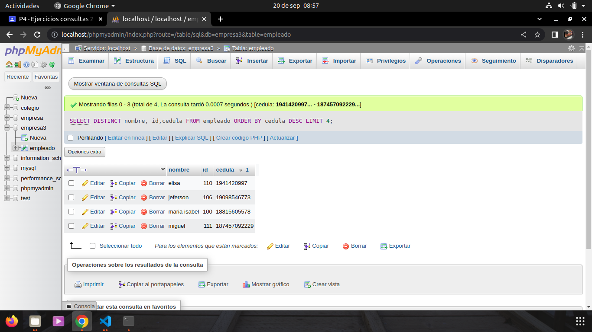

## CONSULTA SQL2

1. Traer el nombre, cedula, sueldo,from empleados where (ciudad=`Medellin`) order by nombre;

select nombre, cedula, sueldo, from empleados where (ciudad=`medellin`) order by cedula desc;

2. traer el nombre y salario de los primero 25 empleado cuo sueldo es mayor de 600000 ordenandolos en forma ascendene por el numero de cedula 
SELECT TOP 25 NOMBRE, SUELDO FROM EMPLEADOS WHERE (SUELDO>600000) ORDER BY CEDULA 

3. Mostrar el nombre ,id y cedula de los primeros 15 empleados cuys nombres sean distintos.Orden la consulta en forma descendente por cedula. 
 SELECT DISTINCT TOP 15 NOMBRE, ID,CEDULA FROM EMPLEADOS ORDER BY CEDULA DESC;
 

 4. Entregar los primeros 15 empleados con nombre y cedula cuya ciudad sea BOGOTA. se necesita que los encabezados de las columnas tengan los siguientes titulos 
                          
                           a. Para el campo nombre------razon social 
                           b. para el campo cedula------identificacion
                           c.ordene la lista en forma descendente por cedula 

SELECT TOP 15 nombres as "razon social", cedula AS "identificacion" FROM empleados WHERE (ciudad='bogota') ORDER BY cedula DESC;

5. Realizar una consulta que entregue el nombre, identificacion, sueldo, edad de los empleados cuyos sueldos esten entre $800000 y $1200000 y cuyas edades esten entre los 23 y 30 años. 

SELECT nombre, cedula, sueldo, edad FROM Empleado WHERE (sueldo BETWEEN 800000 AND 1200000 AND edad BETWEEN 23 AND 35);

6. Realizar una consulta que muestre nombre, cedula y salario de los empleados cuyo nombre comience por la letra c. ordene esta lista por salario en forma descendente.

SELECT nombre, cedula, sueldo FROM Empleado WHERE (nombre LIKE 'c%')ORDER BY sueldo DESC;

